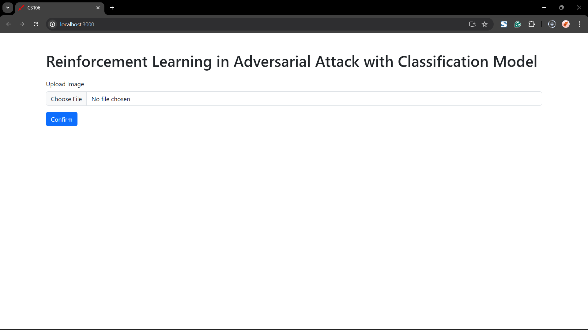
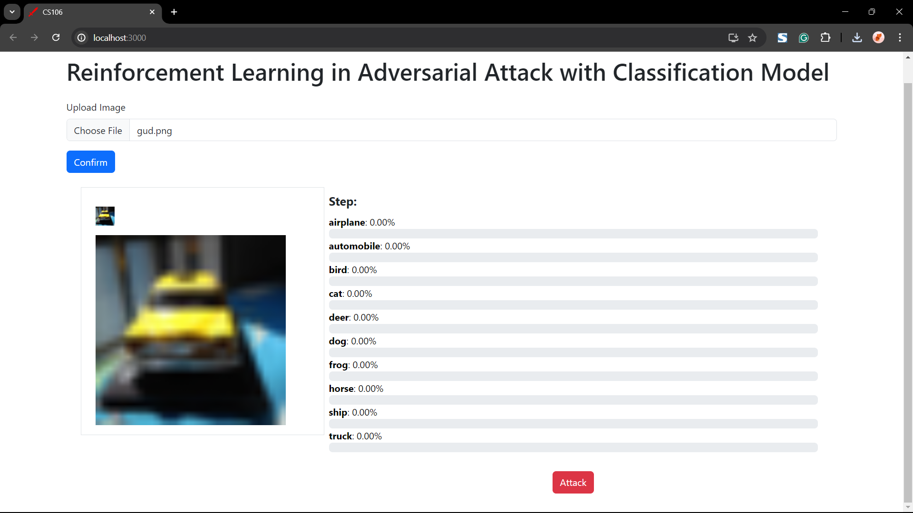
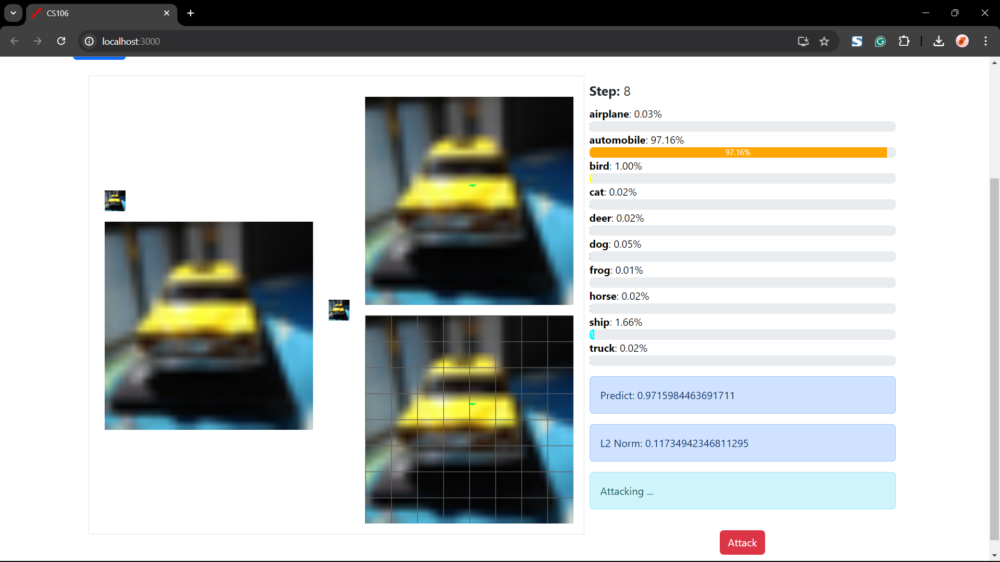
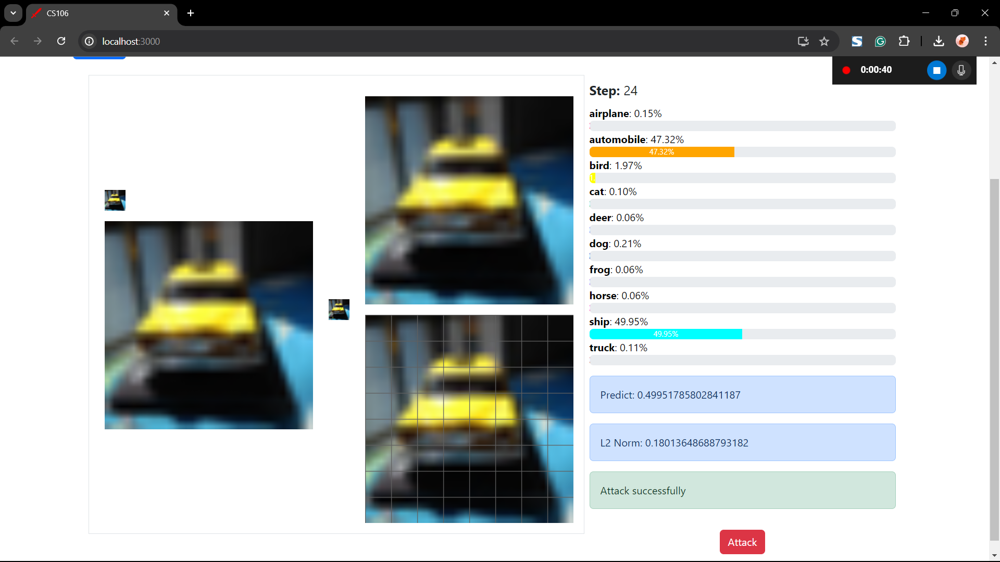
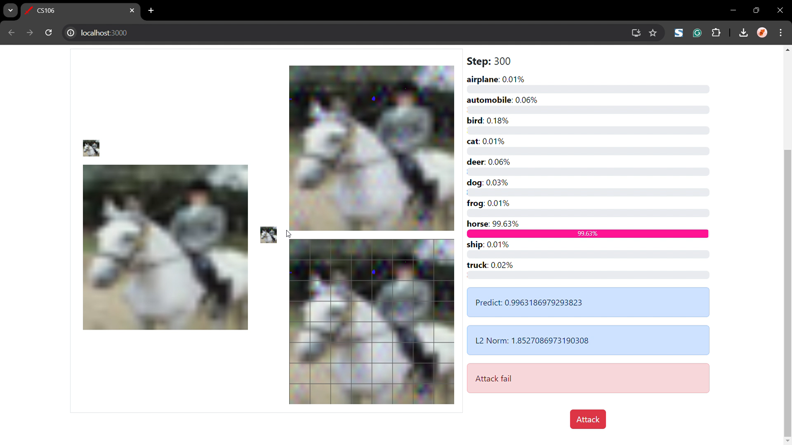

The **.\backend\Adversarial_Attack_deeplearning** folder belongs to my bro TranWoffy, here is his repo: https://github.com/khoa16122004/RLAT-Reinforcement-Learing-in-Adversarial-Attack

# Reinforcement Learing in Adversarial Attack

Welcome to our CS106 project: **Reinforcement Learning in Adversarial Attack** project. 

This repository contains the implementation of adversarial attacks on a classification model using reinforcement learning techniques and the web for demonstration.

## Getting Started

Follow these steps to set up and run the project.

### Clone the Repository

```sh
git clone https://github.com/Ly-Lynn/CS106_RLAT-Reinforcement-Learing-in-Adversarial-Attack
```

### Backend Setup

Navigate to the backend directory and start the FastAPI server:

```sh
cd ./backend/
uvicorn main:app
```

### Frontend Setup

Navigate to the frontend directory to build and start the React project:

```sh
cd ../frontend/
npm run build
npm start
```

Once the project is running, open your browser and go to `http://localhost:3000`.

## Demonstration

### Input Image (32x32)
You can choose your own 32x32 image or get the input image from *.\backend\Adversarial_Attack_deeplearning\Splits*



### Original and Resized Images

On the left: the original image (32x32) and its resized version (320x320).  
On the right: the probability distribution across 10 classes.



### Attack Process

Click the **Attack** button to start the attack process. Three more images will appear on the screen:
1. Attacked image (32x32)
2. Attacked image (320x320)
3. Attacked image with grid visualization

On the right, the probability distribution will update after each iteration. Below this, you will see:
- The highest probability
- The L2 norm between the attacked image and the original image
- The attacking status



### Attack Results

#### Successful Attack



#### Failed Attack


